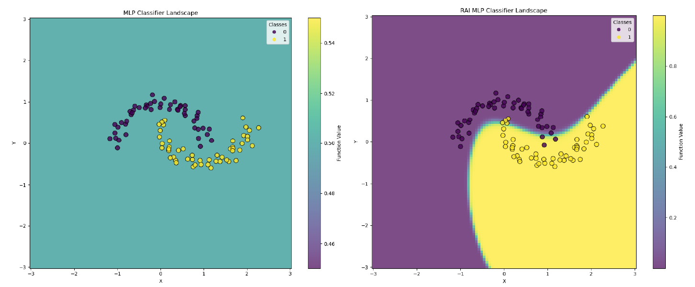

# Relaxed Activation Identity (RAI)

## TL;DR
**Note:** *This is a MSc thesis topic proposal. Any claims made about RAI are hypothetical and based on limited preliminary evidence.*

RAI transforms how gradients flow through neural networks by "relaxing" the strict sequential dependencies between layers. In principle, training deep neural networks would become easier, without the need for explicit architectural changes such as skip connections. The transformation can be carried out automatically by a compiler atop existing auto-differentiation frameworks such as PyTorch, JAX, or TensorFlow.

Below, a comparison of a 101-layers MLP with Sigmoid activations everywhere trained with standard backprop and RAI, respectively:

## Repository Contents

### Notebooks

- [rai-demo.ipynb](rai-demo.ipynb) - Shows the core RAI concept on a shallow network with the Moons dataset, comparing standard and RAI-enhanced networks with ReLU activations.

- [rai-grads.ipynb](rai-grads.ipynb) - Shows RAI with extremely deep networks (101 layers) with sigmoid activations everywhere, where standard backpropagation fails due to vanishing gradients.

### Topic Proposal

- [MSc Thesis Topic Proposal](Topic_Proposal__Relaxed_Activation_Identity.pdf) - Formal proposal describing the theoretical foundations of Relaxed Activation Identity, and preliminary experimental results.

## How It Works

Traditional backpropagation suffers from destructive nonlinearities as gradients flow backward through a network. RAI attempts to break this sequential dependency by:

1. Introducing auxiliary parameters $z^{i}_{t}$ that serve as "target activations" for each layer $t$ and training example $i$.
2. Adding loss terms that encourage the actual activations $\hat{z}^{i}_{t}$ to match these targets.
3. During training, using the targets for forward propagation while updating both model parameters and targets.

## Open Questions

1. **Generalization Capability**: Does RAI generalize as well as standard BP and GD across regression and classification benchmarks?
2. **Regularization Methods**: What regularization methods exist that could aid RAI to retain standard BP and GD's ability to generalize across regression and classification benchmarks?
3. **Initialization Sensitivity**: Is RAI more sensitive than standard BP and GD to the choice of initial model parameters?
4. **Batch Processing Compatibility**: How can we enable RAI to be compatible with batched, mini-batched, and stochastic gradient descent methods?

## Limitations and Additional Findings

While not included in the formal proposal, additional experiments revealed interesting limitations:

- **ReLU Activation Issues**: When using ReLU activations (instead of Sigmoid) in the 101-layer RAI MLP:
  1. The model showed clear signs of overfitting.
  2. The decision landscape developed a grid-like pattern with some cells producing NaN predictions.

This suggests that while RAI effectively addresses the vanishing gradient problem with sigmoid activations, it may introduce different stability challenges when used with ReLU in very deep networks. These findings highlight the need for further investigation into the interaction between RAI and different activation functions.
